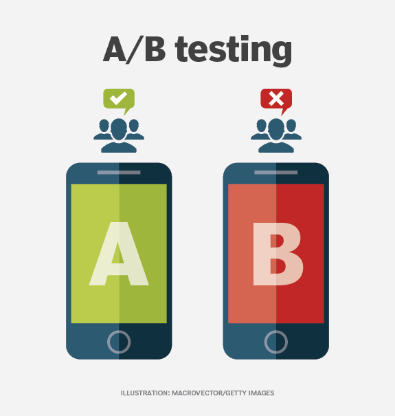

# A-B-Testing_with_Python

## Introduction
SmartAd is a mobile first advertiser agency. It designs intuitive touch-enabled advertising. It provides brands with an automated advertising experience via machine learning and creative excellence. Their company is based on the principle of voluntary participation which is proven to increase brand engagement and memorability 10 x more than static alternatives. 

Challenge : As a Machine learning engineer in SmartAd, one of your tasks is to design a reliable hypothesis testing algorithm for the BIO service and to determine whether a recent advertising campaign resulted in a significant lift in brand awareness.

### Data

The data collected for this challenge has the following columns\
auction_id: the unique id of the online user who has been presented the BIO. In standard terminologies this is called an impression id. The user may see the BIO questionnaire but choose not to respond. In that case both the yes and no columns are zero.\
- ``experiment:`` which group the user belongs to - control or exposed.\
- ``date:`` the date in YYYY-MM-DD format\
- ``hour:`` the hour of the day in HH format.\
- ``device_make:`` the name of the type of device the user has e.g. Samsung\
- ``platform_os:`` the id of the OS the user has. \
- ``browser:`` the name of the browser the user uses to see the BIO questionnaire.\

## Solution :The A/B testing framework is the most used statistical framework for making gradual but important changes in every aspect of today’s business

How does the classical A/B testing (using z-test, f-test, etc.) framework work?
The type of test chosen should be based on the sample size and what form you want your hypotheses to test. If you are looking for a specific effect from A/B test, then opt for a z-test or t-test depending on sample size and the knowledge of the population variance. If you want to show that a relationship merely exists, the Fisher’s exact test is appropriate.

## Advantages of sequential A/B testing 

-	Optimize necessary observation (sample size)
- Reduce the likelihood of error
- Gives a chance to finish experiments earlier without increasing the possibility of false results.

